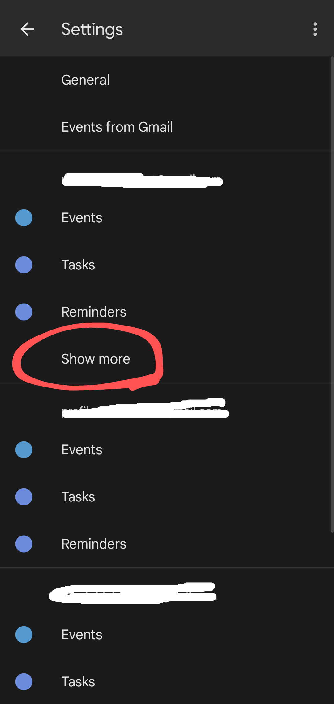

# Timetable Bot
{: .fs-9 .text-center}

## Бот, который помогает с расписанием.
{: .fs-6 .fw-300 }

* Для любой группы и преподавателя
* Автоматическое уведомление об изменениях в расписании
* Поддерживается почта, ВКонтакте, Telegram, Discord и календарь
{: .fs-6 .fw-300 }

<button class="btn js-toggle-dark-mode">Включить темный режим</button>

---

## Начало работы

С ботом можно взаимодействовать через несколько платформ.\
Ниже вы найдете инструкции для каждой из них.

---

## Почта
Для получения расписания через электронную почту, необходимо написать письмо боту на адрес: timetablebot.agz@gmail.com
Но сначала бота нужно настроить:

### Настройки

Для настройки бота укажите в теме сообщения одно из следующих слов:
Настройки / Параметры / Settings / Config

В самом тексте нужно указать группы и преподавателей, расписание для которых вы хотите получать.

Если это **группа**, то можно указать просто номер, *например*: 307, 306, 305.
Номер группы должен совпадать с обозначением группы в расписании на сайте Академии, то есть с буквами, если они есть, и в том же регистре.

Если же вам нужно получать расписание для **преподавателя**, то напишите фамилию и инициалы, учитывая следующие пункты:\
• фамилия должна быть в именительном падеже\
• должен быть только один пробел, после фамилии (до инициалов)\
• после каждого инициала должна быть только точка (после фамилии точка не нужна)\
*Например*: Иванов И.И., Иванова И.И.

Возможна отправка расписания для нескольких групп и/или преподавателей.
Для этого просто укажите в письме настройки несколько запросов (групп и преподавателей).

Настройка получения **уведомлений об изменениях**:\
По умолчанию, уведомления включены, но вы можете изменить этот параметр, указав в тексте "выключить уведомления", для включения нужно написать "включить уведомления".

Также можно поменять настройку **отображения времени занятий** в расписании:
По умолчанию, время занятий отображается, для выключения напишите "выключить отображение времени занятий", для включения "включить отображение времени занятий".

Для получения ссылок на **календарь**, укажите в письме слово "календарь". Более подробно о том, как ими пользоваться читайте в [соответствующем разделе](#%D0%BA%D0%B0%D0%BB%D0%B5%D0%BD%D0%B4%D0%B0%D1%80%D1%8C).\
При этом, бот может не отвечать на ваши сообщения несколько минут, так как обрабатывает ваш запрос (время обработки напрямую зависит от количества сохраненных групп и преподавателей).

Для успешного получения расписания, обязательно нужно указать для какой группы или преподавателя нужно отправлять расписание, все остальные параметры являются опциональными.
Указанные вами параметры будут использоваться для всех последующих запросов.

Для **удаления всех сохраненных параметров**, напишите письмо с темой, как в письме настройки, а в тексте напишите: "сбросить параметры отправки".

### Получение расписания

Если вам нужно получить расписание, то напишите боту сообщение, указав в теме слово: "Сейчас".\
А в тексте указать на какую неделю: текущую или следующую.

Вы не получите расписание, если предварительно не настроили для какой группы или преподавателя вам нужно присылать сообщения.
То есть можно сделать запрос с отправкой расписания, только после отправления письма с настройкой.

**Внимание!**\
Каждое сообщение, которое вы отправляете боту должно быть "новым", т.е. нельзя использовать "Ответить" и "Переслать".

---

## ВКонтакте
Поддерживается отправка расписания через личные сообщения и чаты.

### Личные сообщения
Для получения расписания через личные сообщения, напишите слово "Начать" в личные сообщения сообществу: [Сообщество Timetable Bot](https://vk.com/bot_agz)

[Написать сообщение](https://vk.com/im?sel=-199038911){: .btn .btn-blue }

Затем в сообщении укажите для каких групп и преподавателей нужно присылать расписание.

Если это **группа**, то можно указать просто номер, *например*: 307, 306, 305.
Номер группы должен совпадать с обозначением группы в расписании на сайте Академии, то есть с буквами, если они есть, и в том же регистре.

Если же вам нужно получать расписание для **преподавателя**, то напишите фамилию и инициалы, учитывая следующие пункты:\
• фамилия должна быть в именительном падеже\
• должен быть только один пробел, после фамилии (до инициалов)\
• после каждого инициала должна быть только точка (после фамилии точка не нужна)\
*Например*: Иванов И.И., Иванова И.И.

В настройках бота можно настроить **уведомления об изменениях** в расписании и **отображение времени занятий** при запросе.

Также, в настройках можно получить ссылки на **Календарь**. Более подробно о том, как ими пользоваться читайте в [соответствующем разделе](#%D0%BA%D0%B0%D0%BB%D0%B5%D0%BD%D0%B4%D0%B0%D1%80%D1%8C).\
При получении ссылок во ВКонтакте есть одна особенность, которую нужно учитывать, а именно: ВКонтакте обрезает отправленные ботом ссылки, и поэтому они становятся недействительными.\
Чтобы этого избежать, следует копировать ссылки сразу после получения сообщения от бота, так как после обновления страницы ссылки сокращаются.

Запросы к боту происходят через кнопки, которые отображаются рядом с полем отправки сообщения, но также возможна отправка команд через написание их вручную.

### Чат
Для добавления бота в чат, нужно нажать кнопку "Добавить в беседу" на странице сообщества.

Или можно нажать эту кнопку:

[Добавить в беседу](https://vk.com/app6441755_-199038911?ref=group_menu){: .btn .btn-blue }

Инструкция для личных сообщений подходит и для бесед, но в беседе к боту нужно обращаться через @bot_agz или /команда.

Также, в беседе нельзя предоставлять боту какие-либо привилегии (администратора, доступ ко всей переписке), иначе он будет некорректно работать.

**Внимание!**\
Бот гарантированно работает через официальный сайт и мобильный клиент ВКонтакте. Все остальные клиенты не поддерживаются, хотя и могут работать.

---

## Telegram
Поддерживается отправка расписания через личные чаты и группы.

### Личные чаты

Для начала взаимодействия с ботом напишите сообщение боту: @timeagzbot

Или можно нажать эту кнопку:

[Написать сообщение](https://t.me/timeagzbot){: .btn .btn-blue }

При первом открытии чата с ботом, у вас появится внизу кнопка "Старт", нажмите её.

Далее, вам нужно написать для каких преподавателей и групп вы хотите получать расписание.

Если это **группа**, то можно указать просто номер, *например*: 307, 306, 305.
Номер группы должен совпадать с обозначением группы в расписании на сайте Академии, то есть с буквами, если они есть, и в том же регистре.

Если же вам нужно получать расписание для **преподавателя**, то напишите фамилию и инициалы, учитывая следующие пункты:\
• фамилия должна быть в именительном падеже\
• должен быть только один пробел, после фамилии (до инициалов)\
• после каждого инициала должна быть только точка (после фамилии точка не нужна)\
*Например*: Иванов И.И., Иванова И.И.

В настройках бота можно настроить **уведомления об изменениях** в расписании и **отображение времени занятий** при запросе.

Также, в настройках можно получить ссылки на **Календарь**. Более подробно о том, как ими пользоваться читайте в [соответствующем разделе](#%D0%BA%D0%B0%D0%BB%D0%B5%D0%BD%D0%B4%D0%B0%D1%80%D1%8C).

Запросы к боту происходят через кнопки, которые отображаются рядом с полем отправки сообщения (внизу экрана), но также возможна отправка команд через написание их вручную.

### Группы

Для добавления бота в группу, следует нажать кнопку "Плюс" в настройках группы (она находится справа от количества участников).\
И указать в поле поиска **"@timeagzbot"**.

Далее, напишите боту сообщение "/начать".\
Преподаватели и группы добавляются таким образом: "/группа преподаватель"

После чего, внизу экрана появится клавиатура с командами.

Инструкция для личных чатов актуальна и для групп.

Не рекомендуется давать боту какие-либо доп. привилегия в группе, это может нарушить его работу.

---

## Discord

Отправка расписания поддерживается **только через серверы**.

К сожалению, _уведомления об изменениях в расписании не работают_ из-за особенностей платформы.

Для добавления бота на сервер перейдите по ссылке:

https://discord.com/api/oauth2/authorize?client_id=946461566914678814&permissions=19456&scope=bot%20applications.commands

Или нажмите на кнопку:

[Добавить на сервер](https://discord.com/api/oauth2/authorize?client_id=946461566914678814&permissions=19456&scope=bot%20applications.commands){: .btn .btn-blue }

Работа с ботом осуществляется через слэш-команды, то есть на обычные текстовые команды он реагировать не будет.

Т.е.: печатаете в канале "/", у вас появляется список доступных команд, выбираете нужную (которая относится к боту), нажимаете Enter.

**Внимание!**\
Убедитесь, что у бота достаточно прав для отправки сообщений в канале, а участников достаточно прав для использования команд приложений.

---

## Календарь

Получение расписания через электронный календарь является, как по мне, **самым удобным способом**, но требует немного больше действий, по сравнению с другими платформами.\
С другой стороны, вам требуется настроить его лишь один раз.

Календарь самообновляем, то есть при изменении расписания, он обновится автоматически.

## Ссылки
Для настройки календарей, нужно сначала получить ссылки на эти календари.\
Ссылки можно получить через любую платформу, из указанных выше.

Алгоритм действий такой:
* настраиваем группы и преподавателей на одной из платформ
* запрашиваем там же ссылки на календари
* копируем полученные ссылки
* вставляем ссылки в нужный вам календарь

Существует много календарей, которые позволяют просматривать расписание. В принципе поддерживается любой календарь, где можно добавить iCal-файл.\
Но я рассмотрю настройку только основных приложений, а именно: Google Календарь и Apple Календарь.

## Google Календарь
### Компьютер
1. Переходим по ссылке [Google Календарь](https://calendar.google.com)
2. Нажимаем на плюс в "Другие календари"
   
3. Выбираем "Добавить по URL"
   
4. Вставляем ссылку в поле "URL календаря"
   
5. Нажимаем "Добавить календарь"
6. Всё, календарь добавлен. Закрываем меню и пользуемся.
   

### Android
Добавить календарь в мобильной версии Google Календаря **нельзя**.\
Можно или добавить календарь через **компьютер**, или открыть **полную** версию сайта **в браузере на устройстве**, и добавить календарь по инструкции для компьютера.

**Обратите внимание!**\
Аккаунт Google должен быть одинаковым и на компьютере, где вы добавляете календарь, и на мобильном устройстве.

После того как вы добавили необходимый календарь в аккаунт, на мобильном устройстве нужно выполнить следующие шаги:
1. Скачать приложение [Google Календарь](https://play.google.com/store/apps/details?id=com.google.android.calendar&hl=ru&gl=US) в Google Play, если у вас его нет
2. Открыть установленное приложение
3. Войти в свой Google Аккаунт, который должен быть тем же, что и на компьютере
4. Открыть меню слева\
   
5. Пролистать вниз до конца, если у вас много календарей\
   
6. Выбрать "Настройки"\
   
7. Под своим аккаунтом выбрать "Ещё"\
   
8. Включить пункт "Синхронизация"\
   
9. Всё, календарь добавлен. Закрываем меню и пользуемся. Может потребоваться выбрать календарь в списке календарей в меню слева.\
   

### IOS
Добавить календарь в мобильной версии Google Календаря **нельзя**.\
Можно или добавить календарь через **компьютер**, или открыть **полную** версию сайта **в браузере на устройстве**, и добавить календарь по инструкции для компьютера.

**Обратите внимание!**\
Аккаунт Google должен быть одинаковым и на компьютере, где вы добавляете календарь, и на мобильном устройстве.

После того как вы добавили необходимый календарь в аккаунт, на мобильном устройстве нужно выполнить следующие шаги:
1. Скачать приложение [Google Календарь](https://apps.apple.com/ru/app/google-%D0%BA%D0%B0%D0%BB%D0%B5%D0%BD%D0%B4%D0%B0%D1%80%D1%8C/id909319292) в App Store, если у вас его нет
2. Открыть установленное приложение
3. Войти в свой Google Аккаунт, который должен быть тем же, что и на компьютере
4. Включить сбоку свой добавленный календарь, если он не включен
   
5. Всё, календарь добавлен. Закрываем меню и пользуемся.
   

## Apple Календарь
### IOS
Apple Календарь, как правило, предустановлен на устройствах IOS, так что скачивать его не нужно.

1. Открываем приложение
2. Нажимаем кнопку "Добавить", которая находится в нижней части экрана
   
3. Выбираем "Добавить подписной календарь"
   
4. Вставляем скопированную ссылку в поле "URL-адрес подписки", нажимаем кнопку "Подписаться"
   
5. Меняем параметры по умолчанию, если необходимо, и выбираем кнопку "Добавить"
6. Всё, календарь добавлен. Закрываем меню и пользуемся. Может потребоваться выбрать календарь в списке календарей в меню слева.
   

---

## Описание вывода

Расписание отправляется в следующем виде:

Группа 101\
ПОНЕДЕЛЬНИК - 01.09.2021\
"1. -"\
"2. 10:45-12:15 (л) 1.1 Вводная лекция 1/101"

Первая строчка - для кого расписание\
Вторая - день недели и дата\
"1. 2. 3. 4. 5." - номера пар\
"-" (прочерк) - отсутствие занятия\
"10:45-12:15" - время пары\
"(л)" - тип занятия (лекция, практика и т.д.)\
"1.1" - номер темы пары\
"Вводная лекция" - сам предмет\
"1/101" - корпус и кабинет

Для преподавателей добавляется номер группы.

---

## Разработчик
Студент 307 группы\
Насонов Никита

---

## Помощь
По всем вопросам просьба писать в ВК: [разработчик](https://vk.com/nicarex) \
Или на почту: my.profile.protect@gmail.com

Через сообщения сообществу писать бессмысленно, никто кроме бота на них не ответит.